# How to assemble the pomodoro timer box:

In this page I describe how to put together your pomodoro timer, the only things that you will need to assemble it are:
- some double sided tape
- some normal tape
- scissors

1) Get one die cut paper box template or make one yourself using the files inside the cut_files folder.
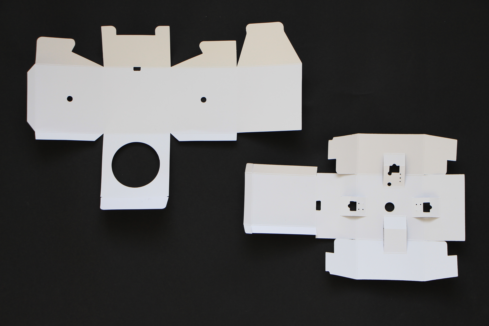

2) Attach the double sided tape on the edge of the external box as shown in the picture.

3) Close the outer box.

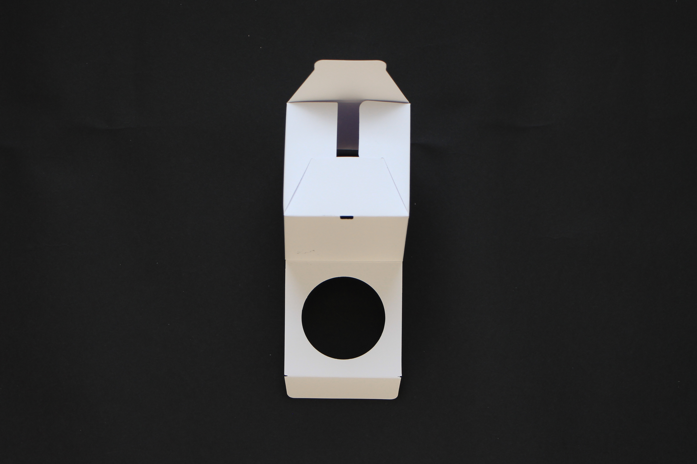
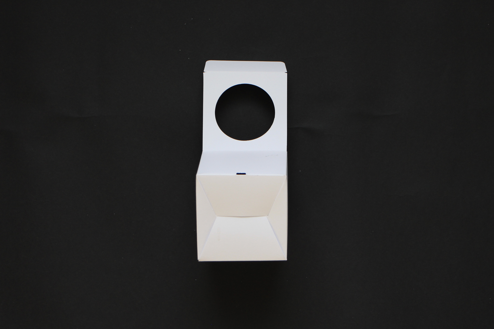
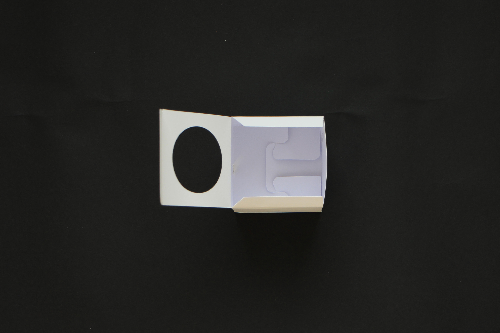

4) Prepare the inner box with double sided tape as shown in the picture.

5) Fold and close the inner box.

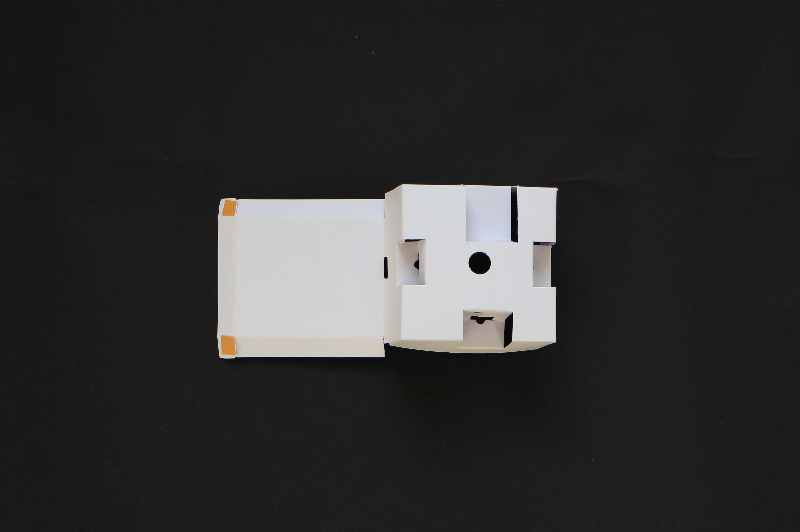
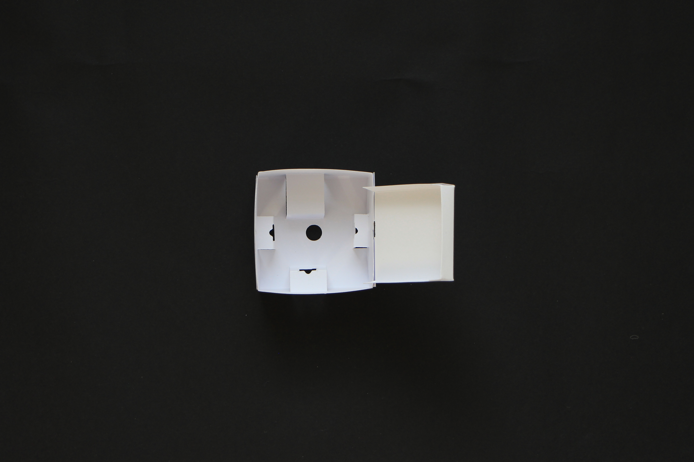

6) Prepare the electronic components:
- 1 Seeeduino Lotus board
- 1 Grove pushbutton
- 1 Grove potentiometer
- 1 Grove buzzer
- 1 Grove ChainableLED
- 1 Servo motor
- 4 Grove cables

7) Attach two pieces of double sided tape to the Grove ChainableLED.

8) Insert the ChainableLED inside the inner box and secure it with the tape.

**⚠ Make sure you connect the Grove cable to connector labelled  IN**

9) Prepare the Grove potentiometer with a small piece of doublesided tape.

10) Attach the potentiometer to the inner box making the connector pass trough the hole.
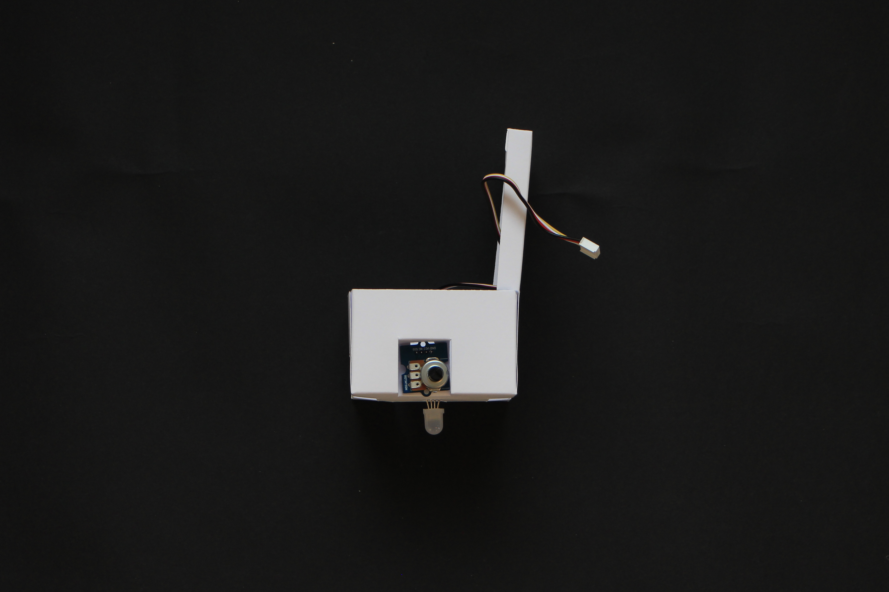

11) Prepare the Grove pushbutton with a small piece of doublesided tape.

12) Attach the pushbutton to the inner box making the connector pass trough the hole.

13) Prepare the servo motor with a small piece of doublesided tape.

14) Attach the servomotor to the inner box making the cable pass trough the opening.
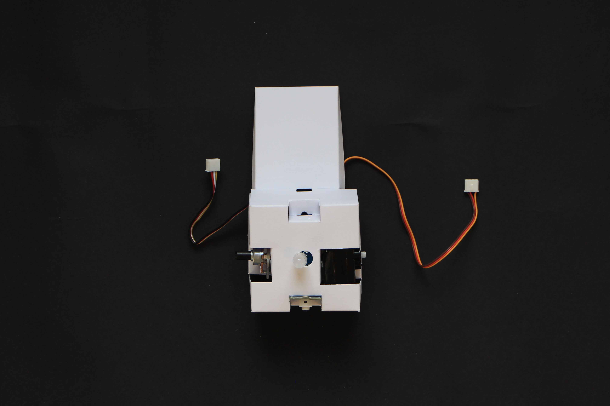

15) Insert the Grove buzzer in the last free slot making sure that the connector points toward the inner side of the box.

16) Attach the remaining Grove cables to the components attached to the box.

17) Insert the Seeeduino Lotus board into its housing making sure that the USB port faces the opening.
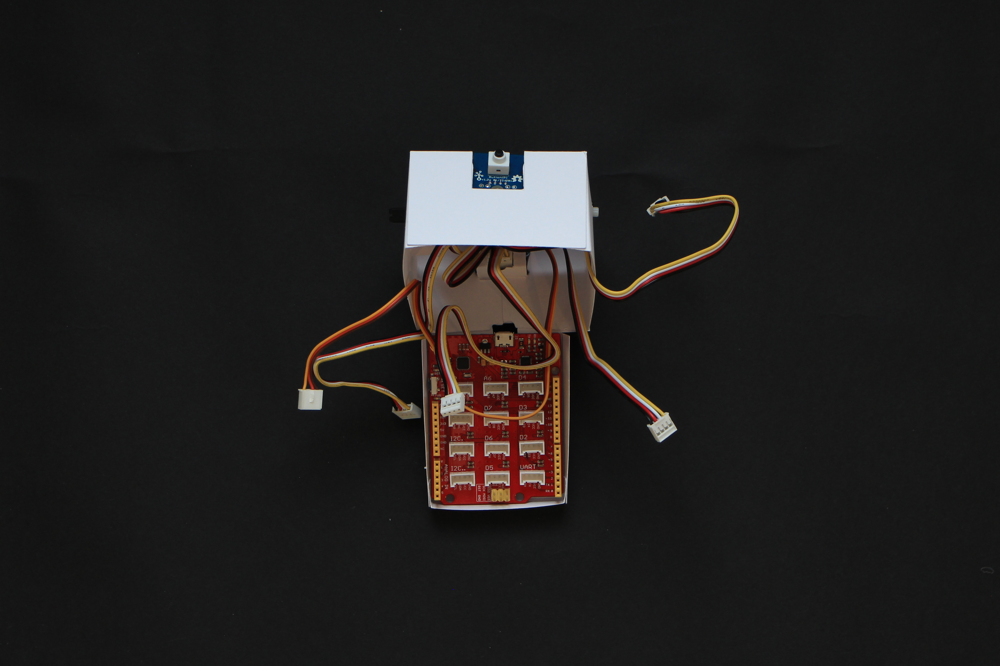

18) Attach the cables following the table below.

Component  | Goes to
--|--
Pushbutton  |  D2
Potentiometer  | A0
Buzzer  | D3
Chainable led  | D4
Servo motor  | D6

19) Try to organize the cables inside and carefully close the box. Use a piece of tape to secure it.

20) Gently insert the inner box inside the outer box making sure the holes for the usb connector are on the same side.

21) Cut a piece of semitranslucent material (e.g. a piece of translucent drawing paper, or a piece of plastic from the packaging of your Grove components) and attach it to the box to cover the hole and diffuse the light of the led.

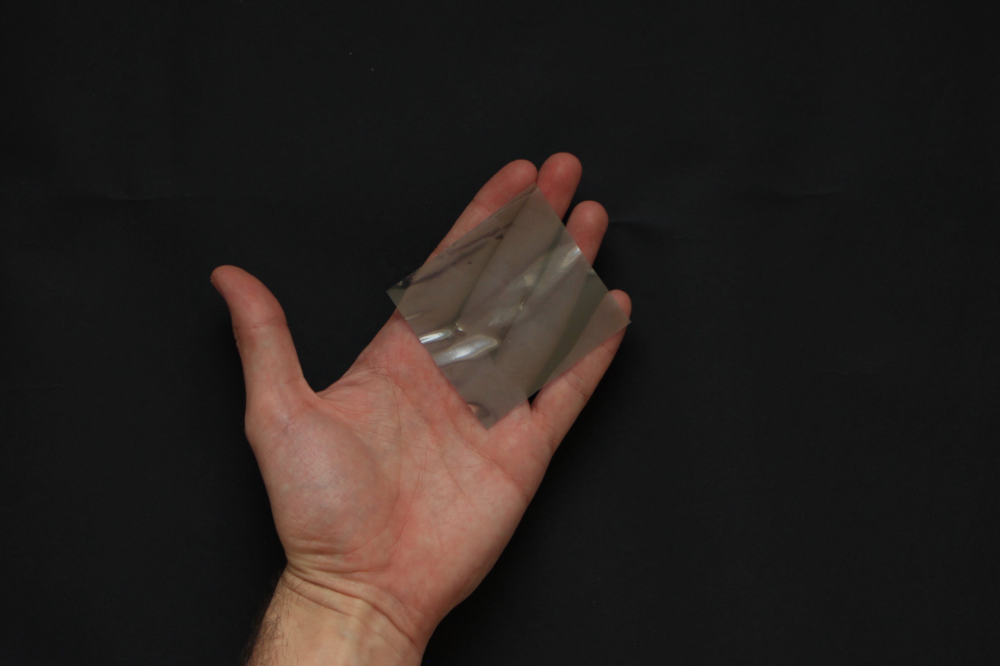

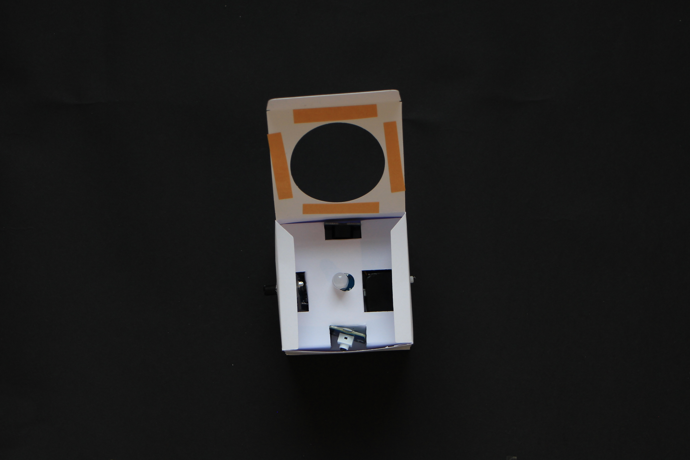
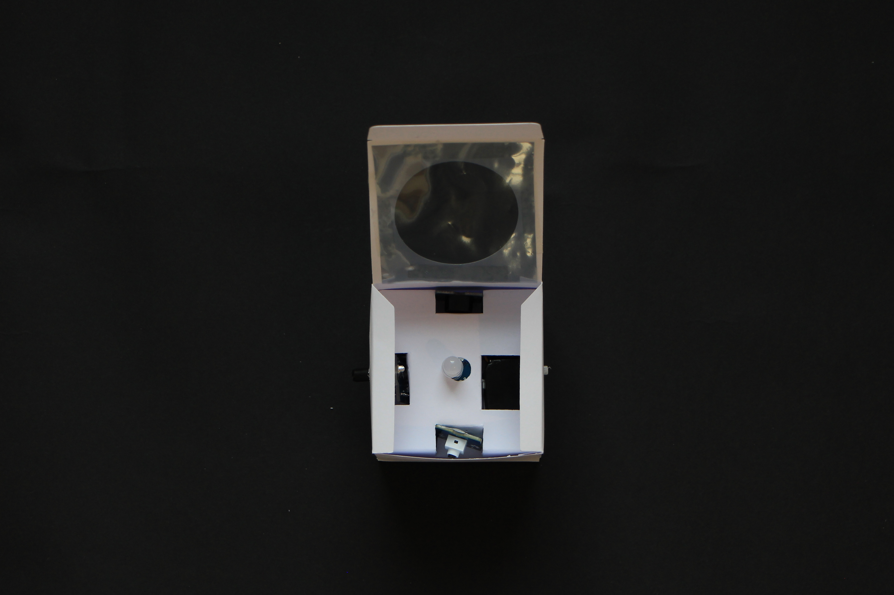

22) Now you can just close the box and start writing some code for it.
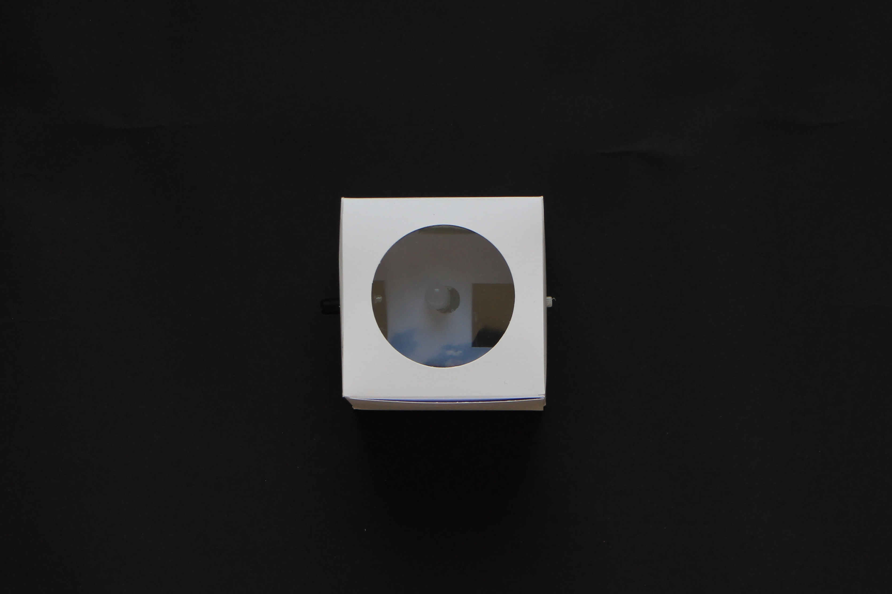
